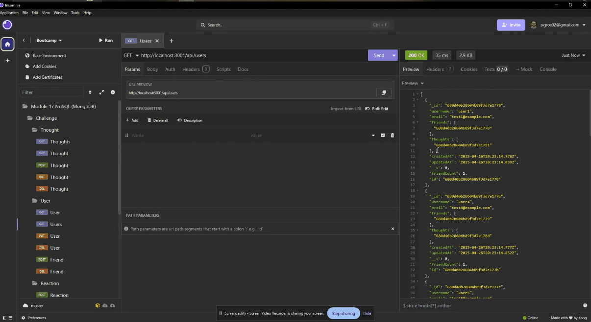

# Social Network API

## Description

This project is a backend API for a social network web application. It's built using Express.js, MongoDB, and the Mongoose ODM. The API allows users to share their thoughts, react to friends' thoughts, and manage a friend list. This application is designed to handle large amounts of unstructured data, which is common in social networking platforms.

## Video Demonstration

The below link is a walkthrough video demonstrating the API's full functionality.  
https://drive.google.com/file/d/1Yt8s-2lAzwaEgM36Yx-DZ_n_ZWB_wkRW/view



## Table of Contents

- [Description](#description)
- [Video Demonstration](#video-demonstration)
- [Table of Contents](#table-of-contents)
- [User Story](#user-story)
- [Getting Started](#getting-started)
  - [Installation](#installation)
  - [Models](#models)
  - [API Routes](#api-routes)

## User Story

AS A social media startup I WANT an API for my social network that uses a NoSQL database SO THAT my website can handle large amounts of unstructured data

### Installation

1.  Ensure MongoDB is installed on your machine. Refer to the [MongoDB installation guide on The Full-Stack Blog](https://www.mongodb.com/docs/manual/installation/) for instructions.
2.  Clone this repository.
3.  Install the necessary dependencies using `npm install`.
4.  Start the MongoDB server.
5.  Start the Express.js server using `npm start`.

### Models

- **User:**
  - `username`: String, Unique, Required, Trimmed
  - `email`: String, Required, Unique, Must match a valid email address
  - `thoughts`: Array of `_id` values referencing the `Thought` model
  - `friends`: Array of `_id` values referencing the `User` model (self-reference)
  - Schema Settings:
    - `friendCount` virtual: Retrieves the length of the user's `friends` array.
- **Thought:**
  - `thoughtText`: String, Required, Between 1 and 280 characters
  - `createdAt`: Date, Default value set to the current timestamp, Getter method to format the timestamp on query
  - `username`: String, Required (The user that created this thought)
  - `reactions`: Array of nested documents created with the `reactionSchema`
  - Schema Settings:
    - `reactionCount` virtual: Retrieves the length of the thought's `reactions` array.
- **Reaction (SCHEMA ONLY):**
  - `reactionId`: Use Mongoose's ObjectId data type, Default value is set to a new ObjectId
  - `reactionBody`: String, Required, 280 character maximum
  - `username`: String, Required
  - `createdAt`: Date, Default value set to the current timestamp, Getter method to format the timestamp on query
  - Schema Settings:
    - This is not a model, but a subdocument schema for the `Thought` model's `reactions` field.

### API Routes

- `/api/users`
  - `GET`: All users
  - `GET`: A single user by its `_id` and populated thought and friend data
  - `POST`: A new user:
    ```json
    {
      "username": "lernantino",
      "email": "lernantino@gmail.com"
    }
    ```
  - `PUT`: Update a user by its `_id`
  - `DELETE`: Remove user by its `_id`
  - `BONUS`: Remove a user's associated thoughts when deleted.
- `/api/users/:userId/friends/:friendId`
  - `POST`: Add a new friend to a user's friend list
  - `DELETE`: Remove a friend from a user's friend list
- `/api/thoughts`
  - `GET`: All thoughts
  - `GET`: A single thought by its `_id`
  - `POST`: Create a new thought (pushes the created thought's `_id` to the associated user's `thoughts` array field):
    ```json
    {
      "thoughtText": "Here's a cool thought...",
      "username": "lernantino",
      "userId": "5edff358a0fcb779aa7b118b"
    }
    ```
  - `PUT`: Update a thought by its `_id`
  - `DELETE`: Remove a thought by its `_id`
- `/api/thoughts/:thoughtId/reactions`
  - `POST`: Create a reaction stored in a single thought's `reactions` array field
  - `DELETE`: Pull and remove a reaction by the reaction's `reactionId` value
